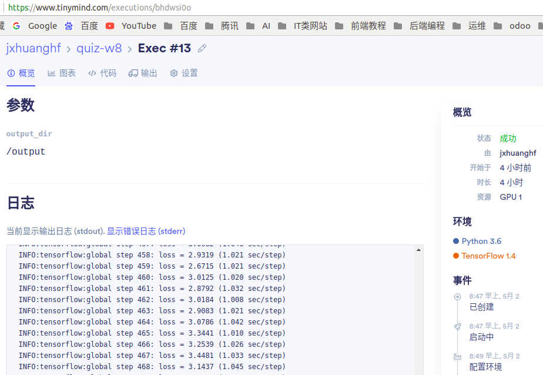
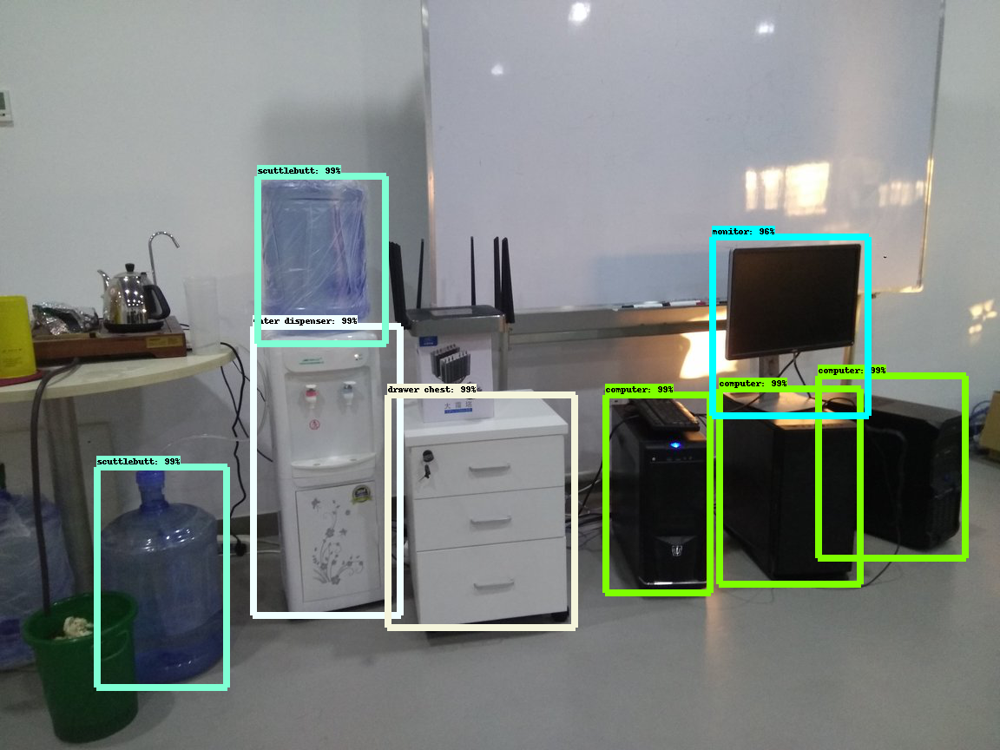

# 第9周作业描述

### 文件目录结构
```
├── create_quiz_w8_tf_record.sh
├── data
│   ├── labels_items.txt
│   ├── pet_train.record
│   ├── pet_val.record
│   ├── pre_trained
│   ├── quiz-w8-data│   
│   ├── ssd_mobilenet_v1_pets.config
│   └── test.jpg
├── inference.py
├── object_detection
├── output
│   ├── eval
│   ├── exported_graphs
│   ├── output.png
│   ├── ssd_mobilenet_v1_pets.config
│   └── train
├── readme.md
├── run_local.py
├── run_local.sh
├── run.py
├── run.sh
└── slim    

```
### 说明
- tensorflow工具包下载地址 https://github.com/tensorflow/models/tree/r1.5,
- 一定要切换到r1.5分支去下载, r1.5分支是基于tensorflow1.5.0写的, r1.6分支是基于tensorflow1.6写的,以此类推.
- 由于作业只涉及object_detection,slim这俩个工具,所以只将这俩个拷贝到项目下.
- 使用pycocotool3.5.1编译 object_detection/protos 下的proto文件
### output目录
- output目录为本地运行结果
- 本地运行是通过在tinymind训练好后,下载tinymind上/output/train下的最新训练文件到本地的train目录,并修改checkpoint文件后
- 再在本地运行export_inference_graph.py 及 inference.py 输出需要的结果
### 数据集
- 下载https://gitee.com/ai100/quiz-w8-data.git数据集,
- cp object_detection/dataset_tools/create_pet_tf_record.py object_detection/dataset_tools/create_quiz_tf_record.py 
- 编辑create_quiz_tf_record.py 文件使其适应quiz-w8数据集
- 运行下面脚步得到tf.record数据
	```commandline
	sh create_quiz_w8_tf_record.sh
	```

### 预训练模型
- 在https://github.com/tensorflow/models/blob/master/research/object_detection/g3doc/detection_model_zoo.md 下载ssd_mobilenet_v1_coco_2017_11_17
- 注意与配置文件ssd_mobilenet_v1_pets.config要匹配

### 配置文件修改
- ssd_mobilenet_v1_pets.config的5个路径修改
- eval_config.num_examples修改
- model.ssd.num_classes修改

### 模型训练
运行脚本
```commandline
python run.py
```

### 结果评估


### 心得体会
- 本次作业主要是熟悉了使用tensorflow工具包去对特定数据集的目标检测
- 对tensorflow工具包的版本问题更熟悉了
- 熟悉了tf.record数据集的生成
- 熟悉对配置文件的修改,及可能出现的配置出错引起的报错.
